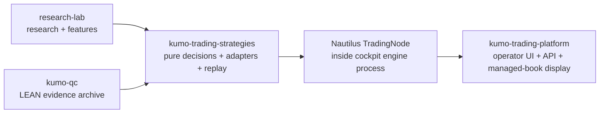
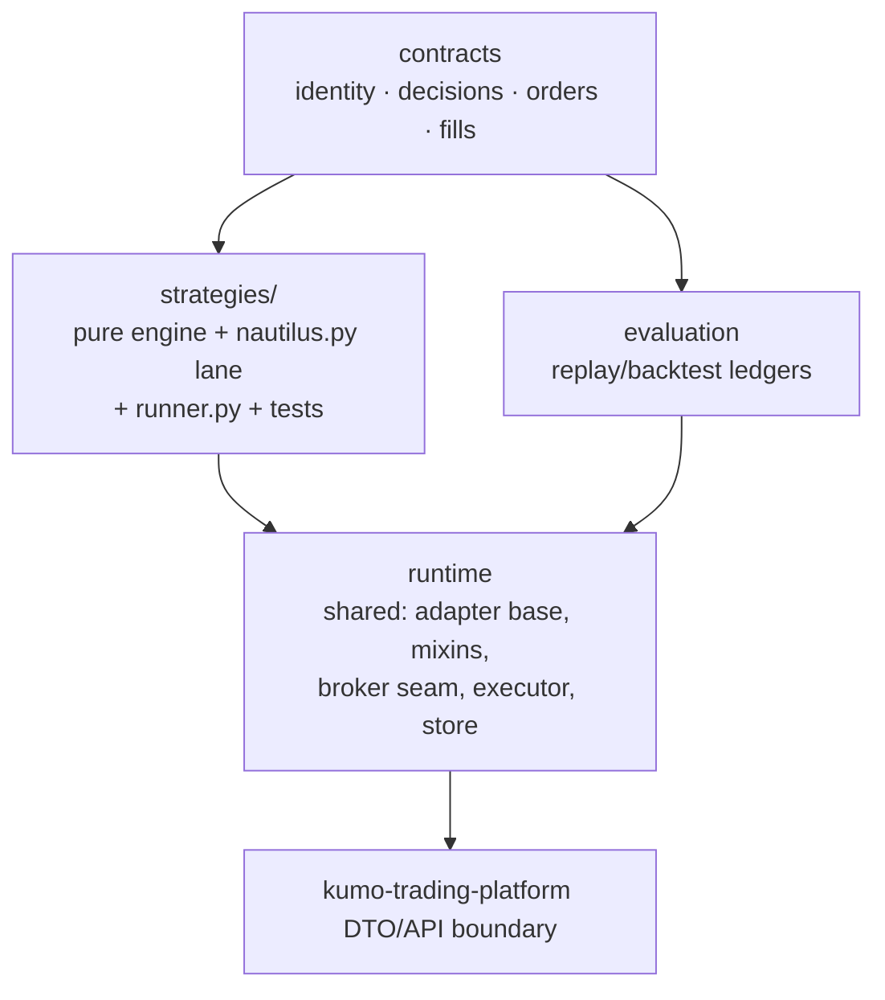

# ARCHITECTURE — kumo-trading-strategies

Living document for executable strategy architecture.

## System Context

## Internal Shape

## Ownership Principles

- Strategies produce decisions; adapters translate decisions into runtime-specific actions.
- Everything for a strategy sits in `strategies/<name>/` (ks#211): pure engine, Nautilus lane (`nautilus.py`), session runner (`runner.py`), tests, backtests. `runtime/` is shared code only; the pre-move `runtime/nautilus/<strategy>.py` and `runtime/executor/<strategy>_runner.py` paths are re-export shims for cockpit. `strategies/_layout.py` is the one discovery point for lanes and runners.
- Nautilus integration must preserve native `strategy_id` attribution and explicit `cycle_id` projection.
- The UI consumes engine-authored state; it does not reconstruct strategy lifecycle from display streams.
